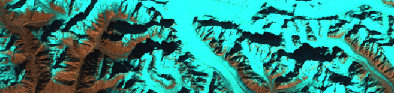

```{r setup, include=FALSE}
knitr::opts_chunk$set(echo = FALSE)
```

This workshop explores the role of visualization in data science workflows that
use satellite imagery. We'll get hands-on experience with how visualization can
support,

* Data validation and cleaning
* Model inspection and error analysis.

We'll walk through a toy version of a glacier mapping problem. Using freely
available Landsat imagery, we'll train a model to recognize different types of
glaciers. You are encouraged to bring problems of your own for group discussion.

## Prerequisites

* Basic familiarity with R
* You should be able to enter the binder notebooks linked [here](materials.html)

## Schedule

This workshop will be held on February 17, 2021.

| Time | Format | Topic |
| -- | -- | ---- |
| 2:45 - 3:00pm | Lecture | [Visualization and maps](https://drive.google.com/file/d/1QTxQcaPLS7OAsQf50-TR_nAfV_Ou6DRO/view?usp=sharing) |
| 3:00 - 3:35pm |Interactive Coding | [Data exploration and preprocessing](1-preview.html) |
| 3:35 - 3:50pm | Breakout Session | [Discussion](https://docs.google.com/document/d/1bQ1D-dJJc0hIyg17qT0YCRtkw4A0AaCJ_-yx5MahE98/edit?usp=sharing) |
| 3:50 - 4:25 | Interactive Coding | [Model training and inspection](3-train.html) |
| 4:25 - 4:45pm | Debrief | [Open Discussion](https://docs.google.com/document/d/1bQ1D-dJJc0hIyg17qT0YCRtkw4A0AaCJ_-yx5MahE98/edit?usp=sharing) |

## Resources

* [Introduction to Data Science: Chapter 7](https://rafalab.github.io/dsbook/ggplot2.html)
* [R for Data Science: Chapter 12](https://r4ds.had.co.nz)
* [Geographic Data in R: Chapter 2](https://geocompr.robinlovelace.net/spatial-class.html)
* [Spatial Data Science with R](https://rspatial.org/raster/index.html)
* [Towards better analysis of machine learning models: A visual analytics perspective](https://arxiv.org/abs/1702.01226)

## Contact

Do you have any questions about the workshop? Don't hesitate to reach out to
[ksankaran@wisc.edu](mailto:ksankaran@wisc.edu).